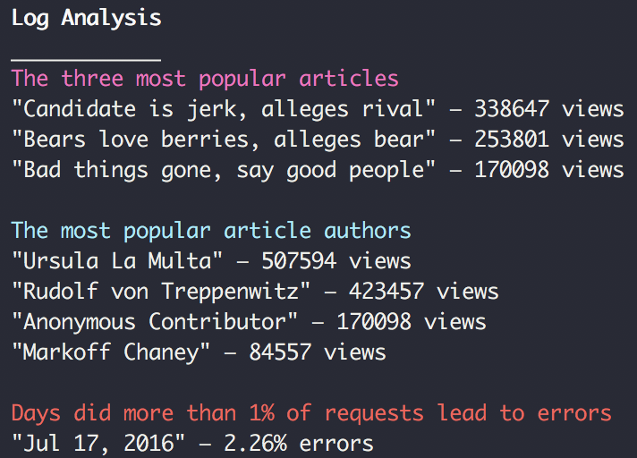

# Logs Analysis

> This is the solution for the Logs Analysis project in Udacity Full Stack Nanodegree course.
> I had to execute complex queries on a large database (> 1000k rows) to extract intersting stats.

The database in question is a newspaper company database where we have 3 tables; `articles`, `authors` and `log`.

-   `articles` - Contains articles posted in the newspaper so far.
-   `authors` - Contains list of authors who have published their articles.
-   `log` - Stores log of every request sent to the newspaper server.

This project implements a single query solution for each of the question in hand.
See [logs.py](logs.py) for more details.

## How to run

### PreRequisites:

-   [Python3](https://www.python.org/)
-   [Vagrant](https://www.vagrantup.com/)
-   [VirtualBox](https://www.virtualbox.org/)

### Setup Project:

1. Install Vagrant and VirtualBox
2. Download or Clone [fullstack-nanodegree-vm](https://github.com/udacity/fullstack-nanodegree-vm) repository.
3. Download the [data](https://d17h27t6h515a5.cloudfront.net/topher/2016/August/57b5f748_newsdata/newsdata.zip) from here.
4. Unzip this file after downloading it. The file inside is called newsdata.sql.
5. Copy the newsdata.sql file and content of this current repository, by either downloading or cloning it from
   [Here](https://github.com/sagarchoudhary96/Log-Analysis)

### Launching the Virtual Machine:

1. Launch the Vagrant VM inside Vagrant sub-directory in the downloaded fullstack-nanodegree-vm repository using command:

```
  $ vagrant up
```

2. Then Log into this using command:

```
  $ vagrant ssh
```

3. Change directory to /vagrant and look around with ls.

### Setting up the database

1. Load the data in local database using the command:

```
  psql -d news -f newsdata.sql
```

2. Use `psql -d news` to connect to database.

## Output

The program will output a report for the following questions:

-   Top Articles, the 3 most viewed articles
-   Top Authors, the most popular authors
-   Requests with errors, The days with more than 1% of error on page requests.

### Example of output



You also find an example of output in [output.txt](output.txt)
